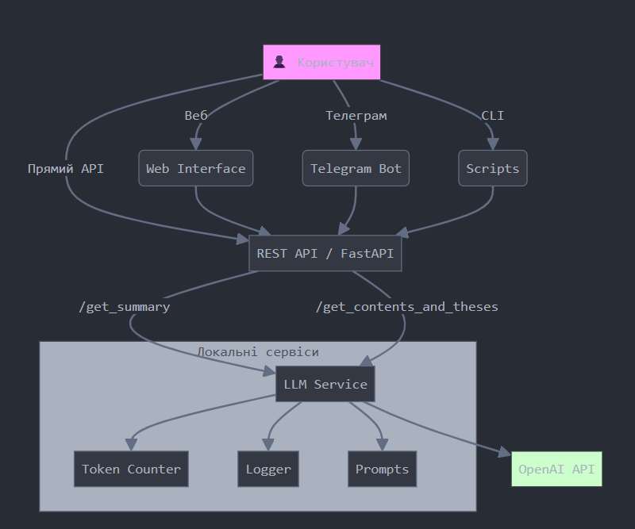
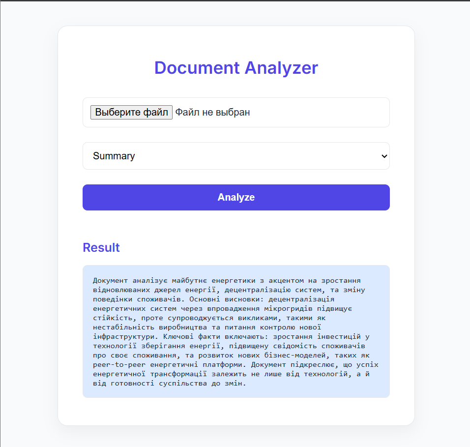
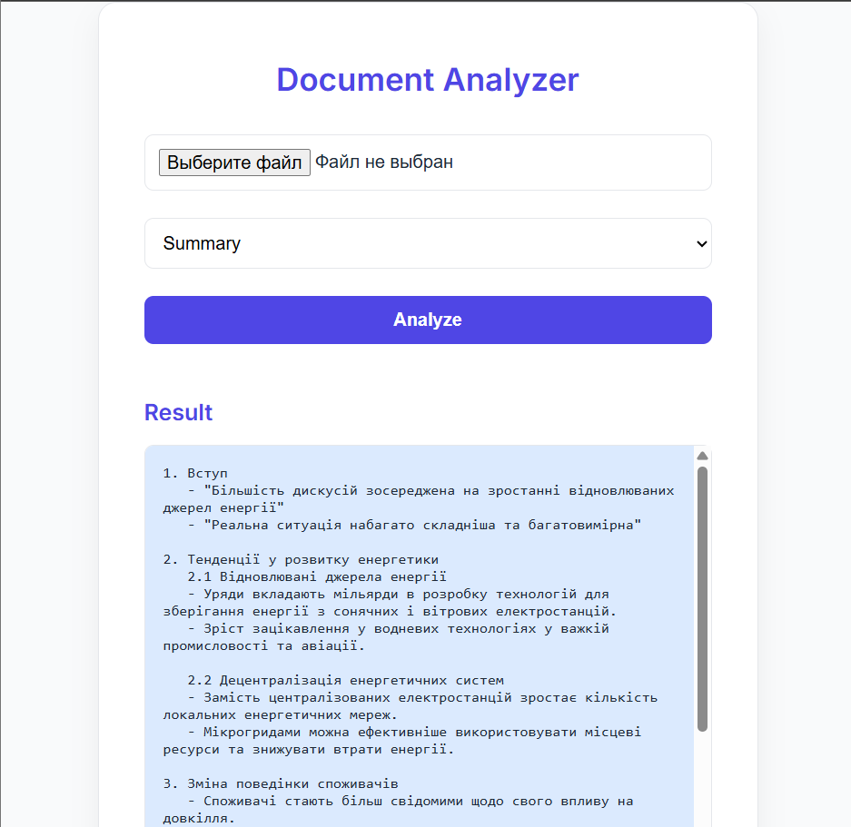
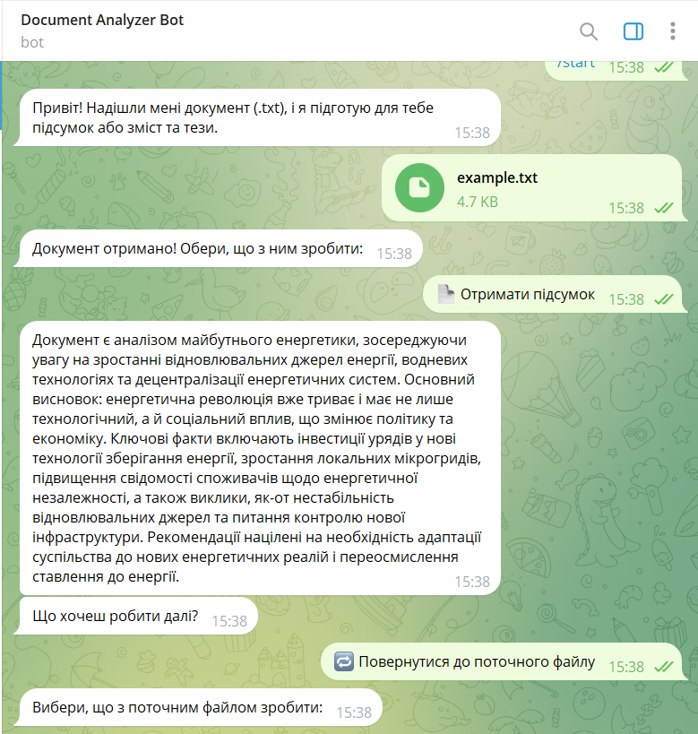
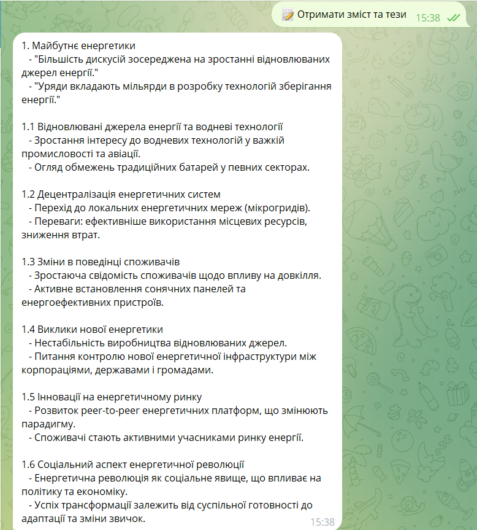

# Система для аналізу текстових документів
Виконала студентка групи КВ-13 Саюн Дарина

## Технології:
- Python 3.11+
- FastAPI
- OpenAI API
- aiogram
- Jinja2
- Uvicorn

---

## Інструкція з встановлення та запуску:

1. **Клонування проєкту:**
   ```bash
   git clone https://github.com/SaiunD/DocAnalyzer.git
   cd doc_analyzer
   ```

2. **Створення віртуального середовища:**
   ```bash
   python -m venv venv
   source venv/bin/activate  # Windows: venv\Scripts\activate
   ```

3. **Встановлення залежностей:**
   ```bash
   pip install -r requirements.txt
   ```

4. **Налаштування .env:**
   Створіть файл `.env` у корені проєкту:
   ```env
   OPENAI_API_KEY=your_openai_key
   TELEGRAM_BOT_TOKEN=your_telegram_token
   DOCUMENT_PATH=input/input.txt
   SUMMARY_OUTPUT_PATH=output/summary.txt
   CONTENTS_OUTPUT_PATH=output/contents.txt
   ```

---

## Приклади використання різних режимів:

### 1. **Script Mode:**
```bash
python main.py --mode script
```
Результати: `output/script_summary.txt` та `output/script_contents.txt`

### 2. **API Test Mode:**
```bash
python main.py --mode api
```
Результати: `output/api_summary.txt` та `output/api_contents.txt`

### 3. **Telegram Bot Mode:**
```bash
python main.py --mode bot
```

### 4. **Web UI Mode:**
```
python main.py --mode web
```
---

## Формат файлів конфігурації (.env):
```ini
# API Keys
OPENAI_API_KEY=sk-...
TELEGRAM_BOT_TOKEN=123456:ABC-...

# Input/Output paths
DOCUMENT_PATH=input/input.txt
SUMMARY_OUTPUT_PATH=output/summary.txt
CONTENTS_OUTPUT_PATH=output/contents.txt
```

---

## Структура логів та метрик:
- **Формат логів:** логування відбувається в консоль за допомогою модуля `logging`
- **Приклади:**
  ```
  [2025-04-25 16:10:32] INFO: Summary saved to: output/script_summary.txt
  [2025-04-25 16:10:32] INFO: Tokens used: 356
  [2025-04-25 16:10:32] INFO: Duration: 2.3s
  ```
- **Метрики:**
  - Кількість використаних токенів
  - Тривалість обробки запиту

---

## Діаграма системи:

---

## Приклад виконання

### Вхідний файл `example.txt`
```
Коли мова заходить про майбутнє енергетики, більшість дискусій зосереджена на зростанні відновлюваних джерел енергії. Проте, реальна ситуація набагато складніша та багатовимірна. В усьому світі уряди вкладають мільярди в розробку технологій, які б дозволили зберігати надлишки енергії, отриманої від сонячних і вітрових електростанцій. Одночасно з цим зростає зацікавлення у водневих технологіях, особливо у контексті важкої промисловості та авіації, де традиційні батареї мають суттєві обмеження.
На фоні цього переходу існує ще одна малопомітна, але не менш важлива тенденція — децентралізація енергетичних систем. Замість централізованих електростанцій дедалі більше домогосподарств, підприємств та навіть цілих муніципалітетів переходять на локальні енергетичні мережі. Ці мережі, часто звані мікрогридами, дозволяють ефективніше використовувати місцеві ресурси, знижують втрати при передачі енергії та підвищують стійкість до аварій або природних катастроф.
Паралельно з розвитком технологій змінюється і поведінка споживачів. Люди стають більш свідомими щодо свого впливу на довкілля, починають активно слідкувати за власним споживанням електроенергії, встановлюють сонячні панелі, використовують «розумні» термостати та енергоефективні прилади. У багатьох країнах енергетична незалежність розглядається не лише як економічна доцільність, а й як питання національної безпеки.
Попри всі переваги, перехід до нової енергетики супроводжується низкою викликів. Серед них — нестабільність виробництва відновлюваних джерел, необхідність масштабної модернізації електромереж, дефіцит рідкоземельних металів для виробництва акумуляторів та турбін. Також залишається відкритим питання: хто контролюватиме нову енергетичну інфраструктуру — великі корпорації, держави чи локальні громади?
У перспективі на нас чекає світ, де електроенергія буде дешевшою, чистішою та доступнішою, але водночас більш складною у керуванні. Вже зараз на ринку з’являються інноваційні моделі бізнесу, що базуються на торгівлі енергією між споживачами — так звані peer-to-peer енергетичні платформи. Ці рішення змінюють парадигму енергетичного ринку, перетворюючи споживача на активного учасника, здатного виробляти, накопичувати та продавати енергію.
Усе це свідчить про те, що енергетична революція вже триває. Вона є не лише технологічним, але й соціальним явищем, яке впливає на політику, економіку та щоденне життя мільйонів людей. Зрештою, успіх цієї трансформації залежатиме не лише від інженерних рішень, а й від готовності суспільства адаптуватися до нових реалій, переосмислити своє ставлення до енергії та змінити звички, що формувались десятиліттями.

```
### 1. Scripts
```
(venv) PS D:\uni\практика\pythonProject> python main.py --mode script
[2025-04-25 15:12:50,687] INFO - Started processing.
[2025-04-25 15:12:56,976] INFO - Summary saved to: output\script_summary.txt
[2025-04-25 15:12:56,976] INFO - Tokens used: 1339
[2025-04-25 15:12:56,976] INFO - Processing completed successfully.
[2025-04-25 15:12:56,976] INFO - Duration: 6.29 seconds
[2025-04-25 15:12:56,976] INFO - Total tokens used: 1339
[2025-04-25 15:12:56,976] INFO - Started processing.
[2025-04-25 15:13:07,208] INFO - Contents saved to: output\script_contents.txt
[2025-04-25 15:13:07,208] INFO - Tokens used: 1941
[2025-04-25 15:13:07,208] INFO - Processing completed successfully.
[2025-04-25 15:13:07,208] INFO - Duration: 10.23 seconds
[2025-04-25 15:13:07,208] INFO - Total tokens used: 1941
```

#### Вміст `script_summary.txt`
```
Документ є аналізом майбутнього енергетики, зосереджуючись на зростанні відновлюваних джерел енергії та децентралізації енергетичних систем. Основний висновок: енергетична революція вже триває, вона є технологічним і соціальним явищем, яке вплине на політику, економіку та повсякденне життя. Ключові факти включають: інвестиції урядів у технології зберігання енергії; зростання зацікавлення водневими технологіями; перехід до мікрогридів для підвищення ефективності. Документ також зазначає виклики, такі як нестабільність відновлюваних джерел та питання контролю нової енергетичної інфраструктури. Рекомендується оцінити соціальні зміни та готовність суспільства адаптуватися до нових енергетичних реалій.
```

#### Вміст `script_contents.txt`
```
1. Вступ
   - "Більшість дискусій зосереджена на зростанні відновлюваних джерел енергії."
   - "Реальна ситуація набагато складніша та багатовимірна."

2. Тенденції у розвитку енергетики
   2.1 Відновлювані джерела та технології зберігання енергії
       - Уряди вкладають мільярди в розробку технологій для зберігання надлишків енергії.
       - Зростає зацікавлення у водневих технологіях, особливо у важкій промисловості та авіації.
   2.2 Децентралізація енергетичних систем
       - Домогосподарства та підприємства переходять на локальні енергетичні мережі, які знижують втрати при передачі енергії.
       - Мікрогриди підвищують стійкість до аварій та природних катастроф.

3. Зміна поведінки споживачів
   - Споживачі стають більш свідомими про свій вплив на довкілля.
   - Встановлення сонячних панелей та використання «розумних» термостатів стає популярним.

4. Виклики переходу до нової енергетики
   4.1 Нестабільність виробництва та модернізація 
       - Нестабільність виробництва відновлюваних джерел потребує масштабної модернізації електромереж.
   4.2 Ресурси та контроль інфраструктури
       - Дефіцит рідкоземельних металів для акумуляторів і турбін.
       - Питання контролю нової енергетичної інфраструктури залишається відкритим.

5. Майбутнє енергетики
   - Світ електроенергії стане дешевшим, чистішим і доступнішим, але складнішим у керуванні.
   5.1 Інноваційні моделі бізнесу
       - З’являються peer-to-peer енергетичні платформи, які змінюють парадигму енергетичного ринку.

6. Висновки
   - Енергетична революція є технологічним і соціальним явищем, що впливає на політику та економіку.
   - Успіх трансформації залежатиме від готовності суспільства адаптуватися до нових реалій та переосмислити своє ставлення до енергії.
```

### 2. API
```
(venv) PS D:\uni\практика\pythonProject> python main.py --mode api   
[2025-04-25 15:26:28,866] INFO - Starting REST API server...
[2025-04-25 15:26:28,866] INFO - Waiting for server to start...
[2025-04-25 15:26:30,381] INFO - Server is up!
[2025-04-25 15:26:30,381] INFO - Sending request to /api/v1/get_summary ...        
[2025-04-25 15:26:35,157] INFO - Summary: 1331 tokens, Duration: 4.78s
[2025-04-25 15:26:35,157] INFO - Summary saved to: output\api_summary.txt
[2025-04-25 15:26:35,157] INFO - Sending request to /api/v1/get_contents_and_theses ...
[2025-04-25 15:26:43,143] INFO - Contents: 1873 tokens, Duration: 7.97s
[2025-04-25 15:26:43,143] INFO - Contents saved to: output\api_contents.txt        
[2025-04-25 15:26:43,143] INFO - Stopping REST API server...
```
#### Вміст `api_summary.txt`
```
Документ присвячений майбутньому енергетики, з акцентом на роль відновлюваних джерел енергії, водневих технологій і децентралізації енергетичних систем. Основні висновки: перехід до нової енергетики супроводжує багато викликів, таких як нестабільність виробництва відновлюваних джерел і необхідність модернізації електромереж. Ключові факти: уряди світу інвестують мільярди в зберігання енергії; мікрогриди стають популярними; споживачі стають активнішими у стеженні за споживанням; виникають peer-to-peer енергетичні платформи. Рекомендації зосереджені на потребі суспільства адаптуватися до нових реалій та змінити свою енергетичну поведінку.
```

#### Вміст `api_contents.txt`
```
1. Вступ
   - "Коли мова заходить про майбутнє енергетики, більшість дискусій зосереджена на зростанні відновлюваних джерел енергії."
   - "Уряди вкладають мільярди в розробку технологій зберігання енергії."

2. Тенденції в енергетиці
   2.1 Відновлювані джерела енергії
   - "Зростає зацікавлення у водневих технологіях, особливо у контексті важкої промисловості та авіації."
   - "Традиційні батареї мають суттєві обмеження."
   
   2.2 Децентралізація енергетичних систем
   - "Дедалі більше домогосподарств, підприємств та муніципалітетів переходять на локальні енергетичні мережі."
   - "Мікрогриди дозволяють ефективніше використовувати місцеві ресурси і підвищують стійкість до аварій."

   2.3 Зміна поведінки споживачів
   - "Люди стають більш свідомими щодо свого впливу на довкілля."
   - "Енергетична незалежність розглядається як питання національної безпеки."

3. Виклики переходу до нової енергетики
   - "Перехід до нової енергетики супроводжується низкою викликів, серед яких нестабільність виробництва відновлюваних джерел."
   - "Залишається відкритим питання контролю нової енергетичної інфраструктури."

4. Майбутнє енергетики
   - "На нас чекає світ, де електроенергія буде дешевшою, чистішою та доступнішою."
   - "З'являються інноваційні моделі бізнесу, що базуються на торгівлі енергією між споживачами."

5. Соціальний аспект енергетичної революції
   - "Енергетична революція є технологічним і соціальним явищем."
   - "Успіх цієї трансформації залежатиме від готовності суспільства адаптуватися до нових реалій."
```

### 3. Web
```
(venv) PS D:\uni\практика\pythonProject> python main.py --mode web    
INFO:     Will watch for changes in these directories: ['D:\\uni\\практика\\pythonProject']
INFO:     Uvicorn running on http://127.0.0.1:8000 (Press CTRL+C to quit)
INFO:     Started reloader process [21524] using WatchFiles
INFO:     Started server process [41308]
INFO:     Waiting for application startup.
INFO:     Application startup complete.
INFO:     127.0.0.1:62104 - "GET / HTTP/1.1" 200 OK
[2025-04-25 15:28:30,611] INFO - Received file 'example.txt' with mode 'summary'
[2025-04-25 15:28:31,436] INFO - Started processing.
[2025-04-25 15:28:36,212] INFO - Processing completed successfully.
[2025-04-25 15:28:36,212] INFO - Duration: 4.78 seconds
[2025-04-25 15:28:36,212] INFO - Total tokens used: 1343
INFO:     127.0.0.1:62113 - "POST /api/v1/get_summary HTTP/1.1" 200 OK
INFO:     127.0.0.1:62111 - "POST / HTTP/1.1" 200 OK
[2025-04-25 15:35:29,733] INFO - Received file 'example.txt' with mode 'contents'
[2025-04-25 15:35:30,020] INFO - Started processing.
[2025-04-25 15:35:41,384] INFO - Processing completed successfully.
[2025-04-25 15:35:41,384] INFO - Duration: 11.36 seconds
[2025-04-25 15:35:41,384] INFO - Total tokens used: 1921
INFO:     127.0.0.1:62243 - "POST /api/v1/get_contents_and_theses HTTP/1.1" 200 OK 
INFO:     127.0.0.1:62241 - "POST / HTTP/1.1" 200 OK
```
#### Результати



### 4. Telegram Bot
```
(venv) PS D:\uni\практика\pythonProject> python main.py --mode telegram
[2025-04-25 15:37:20,060] INFO - Starting Telegram bot...
[2025-04-25 15:37:20,060] INFO - Starting web server for Telegram bot...
INFO:     Will watch for changes in these directories: ['D:\\uni\\практика\\pythonProject']
INFO:     Uvicorn running on http://127.0.0.1:8000 (Press CTRL+C to quit)
INFO:     Started reloader process [9264] using WatchFiles
INFO:     Started server process [33388]
INFO:     Waiting for application startup.
INFO:     Application startup complete.
INFO:aiogram.dispatcher:Start polling
INFO:aiogram.dispatcher:Run polling for bot @MyDocAnalyzerBot id=7300878856 - 'Document Analyzer Bot'
INFO:aiogram.event:Update id=362850604 is handled. Duration 297 ms by bot id=7300878856
INFO:aiogram.event:Update id=362850605 is handled. Duration 47 ms by bot id=7300878856
INFO:aiogram.event:Update id=362850606 is handled. Duration 204 ms by bot id=7300878856
[2025-04-25 15:38:36,231] INFO - Started processing.
[2025-04-25 15:38:42,844] INFO - Processing completed successfully.
[2025-04-25 15:38:42,844] INFO - Duration: 6.61 seconds
[2025-04-25 15:38:42,844] INFO - Total tokens used: 1344
INFO:     127.0.0.1:62361 - "POST /api/v1/get_summary HTTP/1.1" 200 OK
INFO:aiogram.event:Update id=362850607 is handled. Duration 7047 ms by bot id=7300878856
INFO:aiogram.event:Update id=362850608 is handled. Duration 63 ms by bot id=7300878856
[2025-04-25 15:38:46,909] INFO - Started processing.
[2025-04-25 15:38:54,924] INFO - Processing completed successfully.
[2025-04-25 15:38:54,924] INFO - Duration: 8.02 seconds
[2025-04-25 15:38:54,924] INFO - Total tokens used: 1790
INFO:     127.0.0.1:62368 - "POST /api/v1/get_contents_and_theses HTTP/1.1" 200 OK 
INFO:aiogram.event:Update id=362850609 is handled. Duration 8422 ms by bot id=7300878856
```
#### Результати


